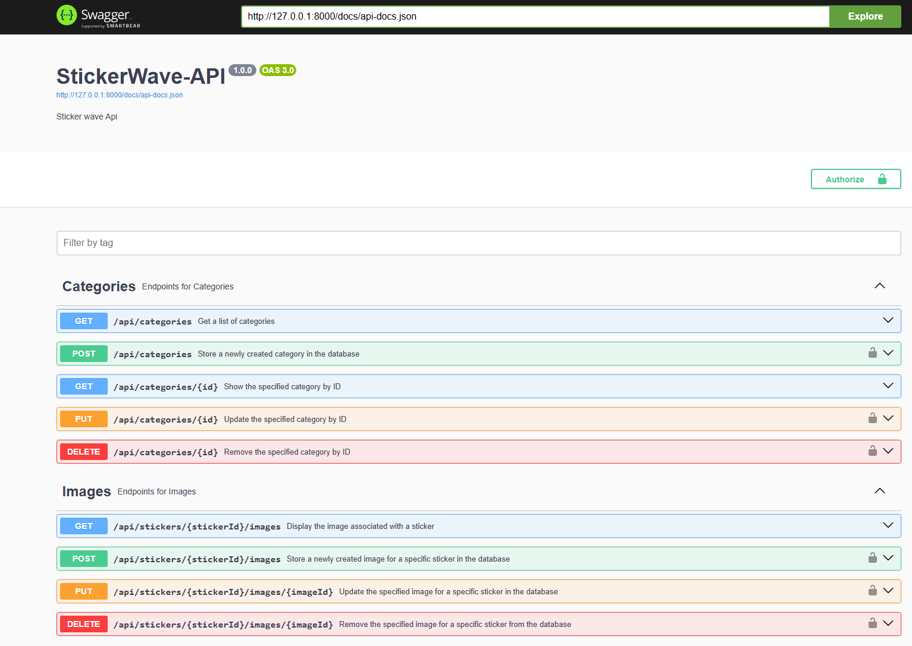
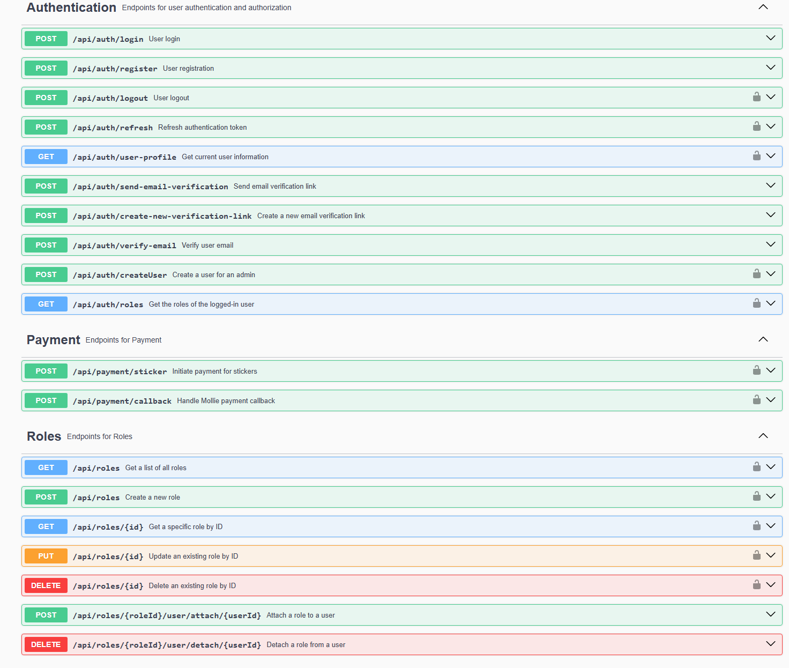
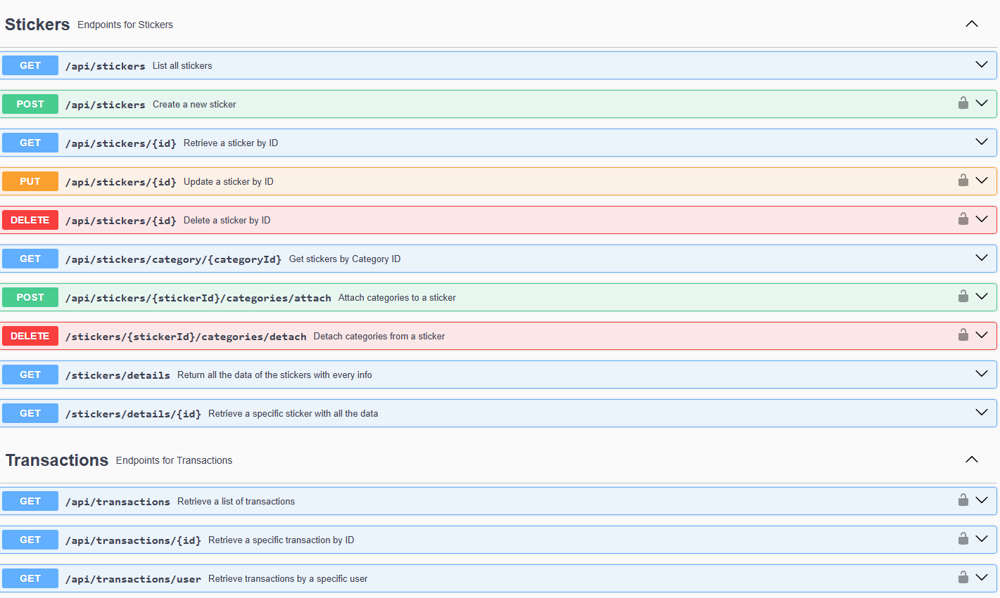

## Stickerwave-api webshop
StickerWave API is a Laravel-based RESTful API designed to power a sticker webshop. It provides a robust set of features to manage stickers(the product), users, roles, orders, and payments seamlessly. Built with Laravel's expressive, elegant syntax, StickerWave API aims to make development an enjoyable and creative experience, ensuring that managing a sticker webshop is as intuitive and efficient as possible.

## Testing and Documentation

In addition to the implementation of the `GenericController` and `GenericControllerViews`, comprehensive tests have been developed to ensure the reliability and stability of every aspect of these controllers. The `CategoryControllerTest` class, for example, demonstrates our commitment to thorough testing, covering all CRUD operations and authorization scenarios to guarantee that our controllers behave as expected under various conditions.

### Features of Testing

- **Comprehensive Test Coverage**: Tests cover all CRUD operations, including creating, reading, updating, and deleting resources, as well as authorization checks to ensure only authorized users can perform certain actions.
- **Use of Laravel's Testing Features**: Utilizes Laravel's built-in testing capabilities, such as `RefreshDatabase` for isolating tests and `WithFaker` for generating test data, to create a robust testing environment.
- **Role-Based Access Control Tests**: Specific tests ensure that actions like deleting a resource are restricted to users with the appropriate roles, reinforcing the security of our web applications.

### Swagger Documentation

For every controller, Swagger documentation has been meticulously crafted to provide clear, concise, and comprehensive API documentation. For the detailed API documentation, visit http://yourdomain.com/api/documentation after setting up the project. This will provide you with all the necessary information to interact with the API endpoints. This documentation includes:

- **Endpoint Descriptions**: Detailed explanations of what each endpoint does, the HTTP methods used, and the expected outcomes.
- **Parameters and Request Bodies**: Information on required and optional parameters, including request body formats for POST and PUT requests.
- **Response Formats**: Detailed structures of expected responses, including status codes and JSON response bodies, ensuring that API consumers have a clear understanding of what to expect.

### Ensuring Quality and Ease of Use

The combination of thorough testing and detailed documentation ensures that our Laravel applications are not only reliable and secure but also easy to use and integrate with. By providing Swagger documentation for every controller, we make it straightforward for developers to understand and utilize our APIs, facilitating a smoother development process and encouraging best practices in API design and consumption.

## About Laravel

Laravel is a web application framework with expressive, elegant syntax. We believe development must be an enjoyable and creative experience to be truly fulfilling. Laravel takes the pain out of development by easing common tasks used in many web projects, such as:

- [Simple, fast routing engine](https://laravel.com/docs/routing).
- [Powerful dependency injection container](https://laravel.com/docs/container).
- Multiple back-ends for [session](https://laravel.com/docs/session) and [cache](https://laravel.com/docs/cache) storage.
- Expressive, intuitive [database ORM](https://laravel.com/docs/eloquent).
- Database agnostic [schema migrations](https://laravel.com/docs/migrations).
- [Robust background job processing](https://laravel.com/docs/queues).
- [Real-time event broadcasting](https://laravel.com/docs/broadcasting).

Laravel is accessible, powerful, and provides tools required for large, robust applications.

## Learning Laravel

Laravel has the most extensive and thorough [documentation](https://laravel.com/docs) and video tutorial library of all modern web application frameworks, making it a breeze to get started with the framework.

You may also try the [Laravel Bootcamp](https://bootcamp.laravel.com), where you will be guided through building a modern Laravel application from scratch.

If you don't feel like reading, [Laracasts](https://laracasts.com) can help. Laracasts contains over 2000 video tutorials on a range of topics including Laravel, modern PHP, unit testing, and JavaScript. Boost your skills by digging into our comprehensive video library.

## Laravel Sponsors

We would like to extend our thanks to the following sponsors for funding Laravel development. If you are interested in becoming a sponsor, please visit the Laravel [Patreon page](https://patreon.com/taylorotwell).

### Premium Partners

- **[Vehikl](https://vehikl.com/)**
- **[Tighten Co.](https://tighten.co)**
- **[Kirschbaum Development Group](https://kirschbaumdevelopment.com)**
- **[64 Robots](https://64robots.com)**
- **[Cubet Techno Labs](https://cubettech.com)**
- **[Cyber-Duck](https://cyber-duck.co.uk)**
- **[Many](https://www.many.co.uk)**
- **[Webdock, Fast VPS Hosting](https://www.webdock.io/en)**
- **[DevSquad](https://devsquad.com)**
- **[Curotec](https://www.curotec.com/services/technologies/laravel/)**
- **[OP.GG](https://op.gg)**
- **[WebReinvent](https://webreinvent.com/?utm_source=laravel&utm_medium=github&utm_campaign=patreon-sponsors)**
- **[Lendio](https://lendio.com)**

## Contributing

Thank you for considering contributing to the Laravel framework! The contribution guide can be found in the [Laravel documentation](https://laravel.com/docs/contributions).

## Code of Conduct

In order to ensure that the Laravel community is welcoming to all, please review and abide by the [Code of Conduct](https://laravel.com/docs/contributions#code-of-conduct).

## Security Vulnerabilities

If you discover a security vulnerability within Laravel, please send an e-mail to Taylor Otwell via [taylor@laravel.com](mailto:taylor@laravel.com). All security vulnerabilities will be promptly addressed.

## License

The Laravel framework is open-sourced software licensed under the [MIT license](https://opensource.org/licenses/MIT).
